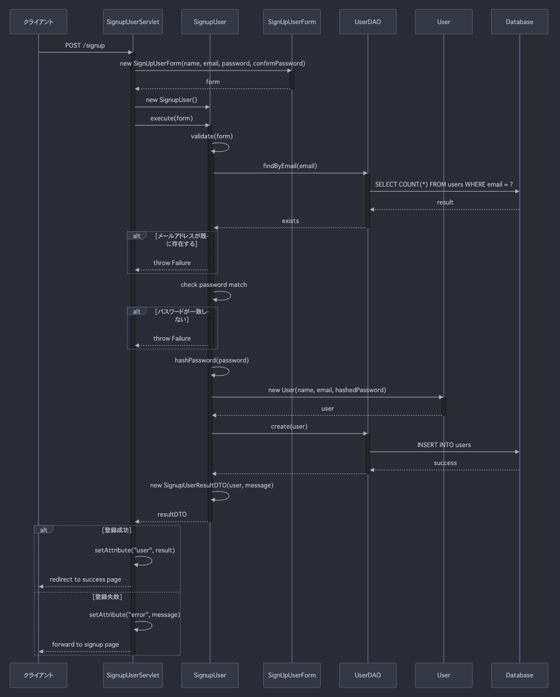

# アプリケーション名

## システム構成

## アーキテクチャ

## ディレクトリ構造の説明

## シーケンス図
### サインアップ

## ユースケース
以下の表は、アプリケーションのユースケースを示しています。

| ユースケース名 | ビュー(jsp) | コントロール(Servlet) | サービス | DAO | エンティティ |  
|--------------|------|------|------|------|------|
|サインアップ|signup.jsp|SignupUserServlet.java|SignUpUser.jsp|UserDAO.java|User.java|
